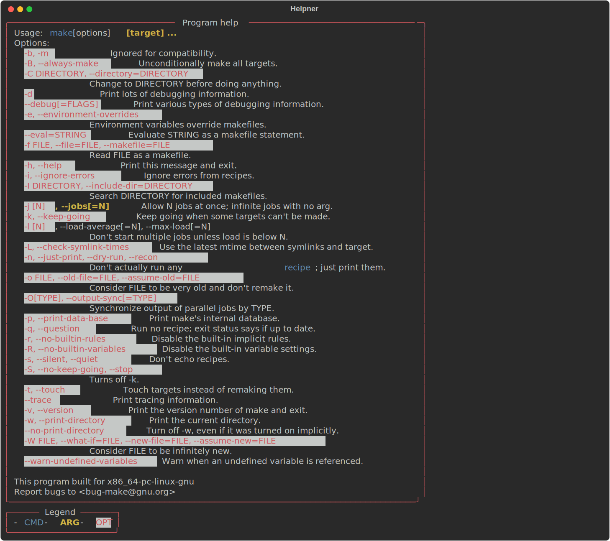
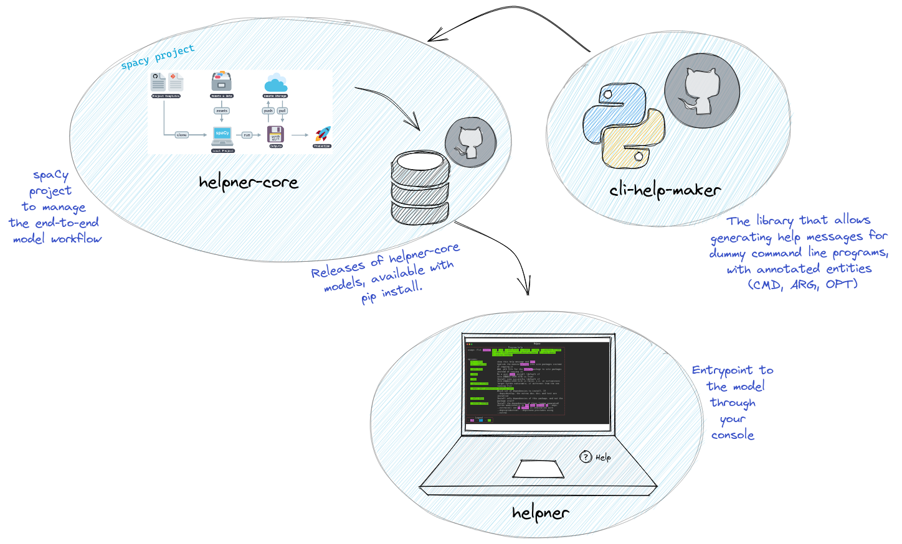

# helpner
Detect the content of CLI help messages 

> :warning:
> This library is a work in progress and a <ins>**proof of concept**</ins>.

Helpner can be used to explore the positions of `commands (CMD)`, `arguments (ARG)` and `options (OPT)` from Command Line Interface program help's messages, using [Named Entity Recognition (NER)](https://spacy.io/usage/spacy-101#annotations-ner).


[](https://spacy.io)
[](https://www.gnu.org/licenses/gpl-3.0)
[](https://github.com/psf/black)
[](https://pypi.python.org/pypi/helpner)


<!-- [](https://codecov.io/gh/plaguss/cli-help-maker) 

-->

---

## :pencil: Examples

Lets see some examples before reading on.

```sh
flit install --help | helpner highlight
```


```sh
make --help | helpner highlight
```


These images are svg screen captures of running the `helpner highlight` against two help messages, [flit install](https://flit.pypa.io/en/stable/cmdline.html#flit-install) and [make](https://linux.die.net/man/1/make) in this case.

<ins>Some notes</ins>:

- The model which powers *helpner* is an **statistical model**, meaning the final output (in the case of the programs shown in the figures) is a prediction which may not be most accurate, see [spaCy models](https://spacy.io/usage/training) for more info on this point.

- The model cannot be better than the data it was built on, and the data which powers the model, is by no means complete or perfect. More info on the data generator can be seen in the corresponding repository [cli-help-maker](https://github.com/plaguss/cli-help-maker).

With this in mind, lets keep reading :smile:

## ...why this:question:

Why not? While reading through [docopt-ng](https://github.com/jazzband/docopt-ng) I thought if it would be possible to detect the components [^1] of a command line interface program and extract them. It turned out to be a fun project. It isn't the best approach for the task, but it allowed to explore a different application of AI, this time from the from and for the console (a nice mix of [spaCy](https://github.com/explosion/spaCy) and [rich](https://github.com/Textualize/rich)!).

[^1]: See [docopt](http://docopt.org/) for a better explanation of the components.

## 👩‍💻 Usage

*helpner*'s CLI is composed of 3 subcommands:

- `helpner highlight`: Main command, throw some color :rainbow: to the help messages with *rich*!

Pipe the help message from the CLI program stdin to the program, and it will print back the original message with the entities detected highlighted and wrapped in a panel. The [style](https://rich.readthedocs.io/en/stable/style.html) applied can be modified for each entity using the options:

```sh
❯ make --help | helpner highlight --style-opt 'red on white' --style-arg 'bold yellow' --style-cmd 'underline blue'
```



It can also capture console content and write it to an svg file thanks to rich:

```sh
❯ make --help | helpner highlight --style-opt 'red on white' --style-arg 'bold yellow' --style-cmd 'underline blue' --save-svg --svg-filename make-other-help.svg
```

- `helpner parse`: It parses the help message, shows the content detected by the model. The keys correspond to the content found, and the values are a tuple with the entity detected and the positions in the string.

The content can be either shown as JSON (it may come handy to dump the content to a file):

```sh
make --help | helpner parse --json > make-helpner.json
```

Or as a Python's dict:

```sh
❯ make --help | helpner parse --no-json
{
    make: ('CMD', 7, 11),
    [target] ...: ('ARG', 22, 34),
    -b, -m: ('OPT', 46, 52),
    -B, --always-make: ('OPT', 103, 120),
    -C DIRECTORY, --directory=DIRECTORY: ('OPT', 167, 202),
    -d: ('OPT', 278, 280),
    --debug[=FLAGS]: ('OPT', 345, 360),
    -e, --environment-overrides: ('OPT', 421, 448),
    --eval=STRING: ('OPT', 523, 536),
    -f FILE, --file=FILE, --makefile=FILE: ('OPT', 594, 631),
    -h, --help: ('OPT', 689, 699),
    -i, --ignore-errors: ('OPT', 748, 767),
    -I DIRECTORY, --include-dir=DIRECTORY: ('OPT', 806, 843),
    -j [N]: ('OPT', 917, 923),
    , --jobs[=N]: ('ARG', 923, 935),
    -k, --keep-going: ('OPT', 996, 1012),
    -l [N]: ('OPT', 1070, 1076),
    -L, --check-symlink-times: ('OPT', 1195, 1220),
    -n, --just-print, --dry-run, --recon: ('OPT', 1275, 1311),
    recipe: ('CMD', 1365, 1371),
    -o FILE, --old-file=FILE, --assume-old=FILE: ('OPT', 1392, 1435),
    -O[TYPE], --output-sync[=TYPE]: ('OPT', 1518, 1548),
    -p, --print-data-base: ('OPT', 1626, 1647),
    -q, --question: ('OPT', 1688, 1702),
    -r, --no-builtin-rules: ('OPT', 1765, 1787),
    -R, --no-builtin-variables: ('OPT', 1832, 1858),
    -s, --silent, --quiet: ('OPT', 1902, 1923),
    -S, --no-keep-going, --stop: ('OPT', 1952, 1979),
    -t, --touch: ('OPT', 2026, 2037),
    --trace: ('OPT', 2096, 2103),
    -v, --version: ('OPT', 2153, 2166),
    -w, --print-directory: ('OPT', 2226, 2247),
    --no-print-directory: ('OPT', 2285, 2305),
    -W FILE, --what-if=FILE, --new-file=FILE, --assume-new=FILE: ('OPT', 2365, 2424),
    --warn-undefined-variables: ('OPT', 2493, 2519)
}
```

- and `helpner download`, which will be explained in the *Installation* section.

More examples can be seen in [assets](./assets/) folder, and better yet, test what you want by yourself. Just keep in mind... The model is far from perfect, the data generator is still a work in progress.

## 🔧 Installation

You can install `helpner` via `pip` (almost ready):

```sh
pip install helpner
```

The program still needs a model to make the predictions, which can be obtained similar to how you would do it with [spaCy's models](https://spacy.io/usage/models)[^2].

[^2]: To see how spaCy's `download` command works visit: [`spacy download`](https://spacy.io/api/cli#download).

So in a second step, you can run the following command:

```sh
helpner download
```

This command will (pip) install the model from [github releases](https://github.com/plaguss/helpner-core/releases), which facilitates two things:

- The model can be updated independently from *helpner*, given that both things can evolve at different speeds

- Simplifies finding the most updated model available (which should be the only one relevant anyway).

*In case the command fails and it couldn't install the package, it will point to the models directly.*

## :bulb: How does it work?

The following sketch[^3] shows the parts involved in the final program:

[^3]: Visit [excalidraw](https://excalidraw.com/) if you don't know it, it's amazing.



- [cli-help-maker](https://github.com/plaguss/cli-help-maker): A library that allows to generate help messages for dummy command line programs, with annotations of the three entities (`CMD`, `ARG` and `OPT`).

- [helpner-core](https://github.com/plaguss/helpner-core): The [spacy project](https://spacy.io/usage/projects) which allows to smoothly manage the end-to-end workflow. More project examples can be found in explosion's [projects](https://github.com/explosion/projects) repository.
    - [releases](https://github.com/plaguss/helpner-core/releases): Releases of *helpner-core* models, uploaded as python packages installable via `pip install`.

- [helpner](https://github.com/plaguss/helpner): The entrypoint to the model via command line interface.
